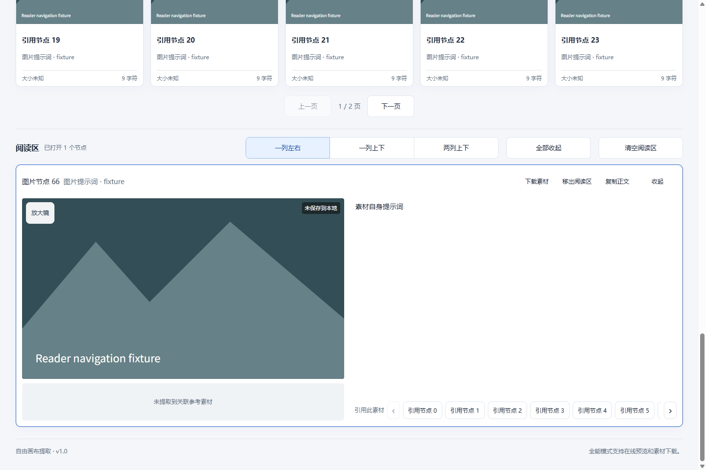
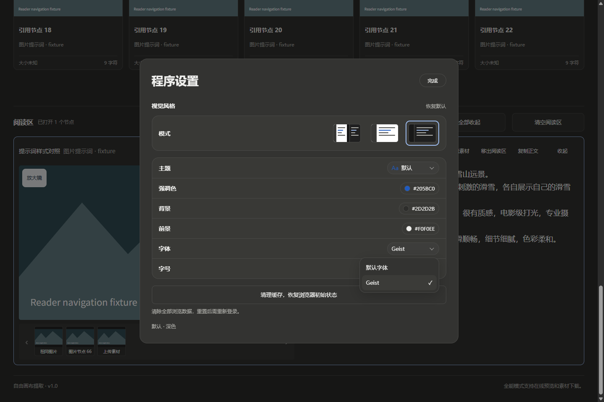

# 自由画布提取

将 **LibTV / 即梦** 画布中的提示词、参考关系和素材整理到本地，方便阅读、保存和继续创作。

**v1.0.0 · Windows x64 便携版**：已包含 Electron 运行时，完整解压后双击 `自由画布提取.exe` 即可启动，无需安装 Node.js。

## 下载与启动

前往 **[v1.0.0 发布页](https://github.com/cc652464876/canvas-prompt-extractor/releases/tag/v1.0.0)**，下载名称包含 `Windows-x64` 和 `便携版` 的 ZIP。GitHub 自动生成的 “Source code” 是源码，不是可直接运行的程序。

1. 将 ZIP **完整解压**到 Windows 10/11 x64 的可写文件夹。
2. 双击 `自由画布提取.exe`，也可使用同目录的启动 CMD。
3. 保留整个文件夹中的 DLL、`resources` 和 `locales`；不要只复制 EXE。

发行包约 151 MiB，提供同名 `.sha256` 校验文件。程序未进行代码签名；请从本仓库 Releases 下载并核对校验值。

## 能做什么

- 读取 LibTV 和即梦作品链接，整理画布节点及提示词。
- 查看图片、视频、音频和参考素材，沿参考关系切换阅读。
- 按类别保存 Markdown 提示词，在全能模式下下载所选素材。
- 打开已保存的本地项目；已下载内容可以离线查看。
- 使用 20 套主题、浅色/深色/跟随系统模式，调整提示词字体和字号。
- 在本机保留两平台独立的登录会话，支持清理浏览器资料。

## 使用方法

点击 LibTV 或即梦账号按钮，在打开的**平台页面**完成登录。粘贴作品链接，点击“开始读取画布”，读取完成后浏览节点并选择要保存的提示词或素材。默认导出位置为桌面的“自由画布提取”，可以在建立项目前更换。

通过“打开本地项目”选择项目中的 `.画布项目.json`，或粘贴项目文件夹路径，即可继续查看。移动项目时应保留记录文件和素材的相对位置。

详细操作见 [使用说明](使用说明.md)。

## 账号安全与隐私

> **你是在直接登录 LibTV 和即梦。作者不会通过本程序获取你的账号密码、验证码或登录 Cookie。**

官方 v1.0 的登录页面由相应平台及其授权登录服务提供，没有作者自建的账号登录服务器，也没有将账号凭据上传给作者的功能。程序仅在本地读取登录状态、昵称和头像以显示账号状态；读取作品及下载平台素材时会使用你的平台会话访问平台和素材服务。

登录会话、Cookie、网站本地存储和缓存保存在 EXE 同目录的 `.runtime/` 中。这些资料具有敏感性，请保护本机和程序文件夹。**分享程序时请使用原始发行 ZIP，不要把运行过的目录、`.runtime/` 或个人项目一起发给他人。**

在“程序设置”中使用“清理缓存，恢复浏览器初始状态”，可清除内置浏览器的登录资料和缓存；导出项目与程序外观偏好保留。反馈问题时不要上传密码、验证码、Cookie 或完整 `.runtime/`。

完整说明见 [账号安全与隐私](账号安全与隐私.md)。上述说明针对本仓库官方 v1.0，第三方修改版不在此说明范围内。平台自身的隐私规则和账号安全机制仍然适用。

## 界面预览

截图使用本地演示数据，不包含真实账号或个人项目。





## v1.0 更新与验证

新增包含运行时的 Windows x64 便携包；修复读取超时及停止等待问题、设置窗口快速关闭/重开问题。发行包按白名单构建，排除账号会话、导出项目和测试资料。详见 [版本说明](版本说明.md)。

发布前通过 90 项单元测试、16 组回归验证、5 组主题验证和 63 个 JavaScript 文件语法检查。最终 ZIP 已验证独立 EXE/CMD 启动、设置保留及目录移动；LibTV 公开示例读取成功。

即梦登录后的真实画布提取、全部媒体 CDN 下载和另一台干净电脑上的运行尚未完成覆盖。平台页面结构、作品权限、会话有效期和素材地址变化可能影响读取或下载；程序不会绕过访问权限。请仅整理你有权访问和使用的作品。

## 源码开发

使用 Node.js 和 npm，在仓库根目录运行：

```sh
npm install
npm test
npm start
npm run package:portable
```

构建便携版需要 Windows x64 和 Electron 44.5.1。开发及验证脚本说明见 [开发说明](docs/DEVELOPMENT.md)。Electron、Chromium、Geist 字体及主题资源保留各自的许可证和来源文件。
